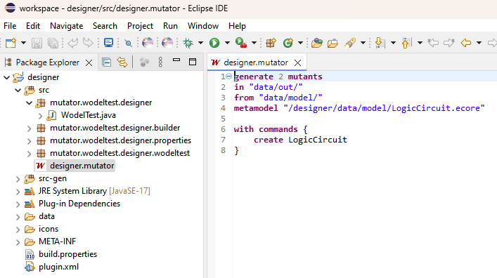
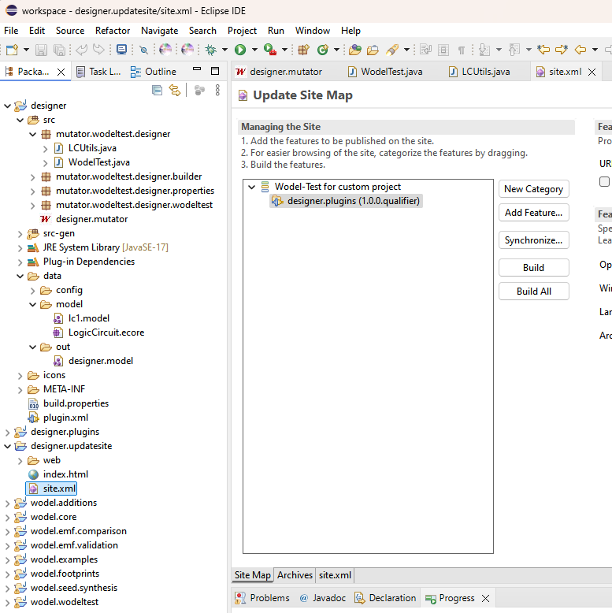
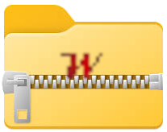

**Wodel-Test** automates the engineering of Mutation Testing (MuT) tools. Given the
meta-model of a language and a set of mutation operators defined with the
**Wodel** domain-specific language, it synthesises a complete, ready-to-install MuT
environment for that language as an Eclipse plug-in — the same model-based recipe has
already produced MuT tools for Java, ATL, finite automata, logic circuits and chatbots.

  <a class="btn-green" href="dropdown/Wodel-Test%20plugins_Wodel-Test%20designer/">Get the Wodel-Test designer</a>
  <a class="btn-green-outline" href="https://github.com/gomezabajo/Wodel-Test/wiki/Get-Started-with-Wodel%E2%80%90Test-Designer" target="_blank">Tutorial</a>
  <a class="btn-green-outline" href="https://github.com/gomezabajo/Wodel-Test" target="_blank">View on GitHub</a>

Overview
### Language-independent mutation testing, generated from models.

<ul class="cap-list">
  <li><strong>Language independence</strong>: MuT tools can be generated for any language defined by a meta-model</li>
  <li><strong>Mutation operators in Wodel</strong>: operators are specified once, at the model level, with the Wodel DSL</li>
  <li><strong>Complete MuT environments</strong>: each generated tool is a full Eclipse plug-in, distributed via its own update site</li>
  <li><strong>Model-based execution</strong>: programs are parsed into models conforming to the language meta-model, mutated, and tested</li>
  <li><strong>Rich metrics</strong>: the generated tools evaluate the test suites on the mutants and report a detailed picture of the MuT process</li>
</ul>

Mutation testing assesses the quality of a test suite by seeding small, systematic
faults — mutants — into the program under test and checking whether the tests detect
them. Building a mutation testing tool for a new language, however, has traditionally
required a substantial ad hoc development effort, repeated for every language.

**Wodel-Test** removes that effort with a model-based approach. Because both the
language and its mutation operators are described as models, the same machinery
generates a tailored MuT tool for each language: the generated tools parse the programs
as models, apply the mutation operators, run the test suites on the resulting mutants,
and offer a rich collection of metrics about the MuT process.

Tool demo
### See a generated MuT tool in action.

  <figure>
    

      <iframe src="https://www.youtube.com/embed/-7NV2VnSC0Q" title="Wodel-Test for Java with jUnit4 in action" loading="lazy" allowfullscreen></iframe>
    

    <figcaption>The generated MuT tool for Java, running with jUnit4.</figcaption>
  </figure>
  <figure>
    

      <iframe src="https://www.youtube.com/embed/chjVhp018IQ" title="Wodel-Test for Java with jUnit5 in action" loading="lazy" allowfullscreen></iframe>
    

    <figcaption>The generated MuT tool for Java, running with jUnit5.</figcaption>
  </figure>

How Wodel-Test works
### From language meta-model to mutation testing results, in five steps.

<article class="step" markdown="1">
<h4>1Provide the language meta-model</h4>
The process starts from an Ecore meta-model describing the abstract syntax of the target
language — Java, ATL, finite automata, logic circuits, chatbot definitions, or any other
language for which a meta-model exists or can be defined.
</article>

<article class="step" markdown="1">
<h4>2Define the mutation operators with Wodel</h4>
Mutation operators are written in **Wodel**, a domain-specific language for model
mutation. Wodel provides mutation primitives for object creation and deletion, reference
redirection, attribute modification, cloning and retyping, and its engine guarantees
that every generated mutant is a valid model of the language.

<figure>
  
  <figcaption>Editing the mutation operators of the target language in the Wodel-Test designer.</figcaption>
</figure>
</article>

<article class="step" markdown="1">
<h4>3Generate the MuT tool with the Wodel-Test designer</h4>
From the meta-model and the operators, the **Wodel-Test designer** synthesises a
complete MuT environment for the language, packaged as an Eclipse plug-in together with
its own update site, ready to be installed and distributed.

<figure>
  
  <figcaption>The update site generated for the new MuT tool.</figcaption>
</figure>
</article>

<article class="step" markdown="1">
<h4>4Run mutation testing</h4>
The generated tool parses the programs under test, representing them as models
conforming to the language meta-model, applies the mutation operators to produce the
mutants, and executes the test suites on them.
</article>

<article class="step" markdown="1">
<h4>5Analyse the results</h4>
The tool reports a rich collection of metrics about the MuT process — including the
mutation score and the mutants that each test detects — helping to assess and improve
the quality of the test suites.
</article>

The tools
### The designer, and the MuT tools generated with it.

Designer
<h4><a href="dropdown/Wodel-Test%20plugins_Wodel-Test%20designer/">./Wodel-Test designer</a></h4>

The framework itself: define a language and its mutation operators, and generate its MuT tool.

[{:style='float: left;margin-right: 12px;margin-top: 4px; height:20px; width:20px;'}](https://github.com/gomezabajo/Wodel/tree/Wodel-Test-designer)[{:style='float: left;margin-right: 12px;margin-top: 4px; height:20px; width:20px;'}](https://gomezabajo.github.io/Wodel/Wodel-Test/designer/update-site)[{:style='float: left;margin-right: 12px;margin-top: 4px; height:20px; width:20px;'}](https://www.dropbox.com/scl/fi/d698rghjmord6r2ig4dya/eclipse.zip?rlkey=57qufltl84a396inezs9l65si&dl=0)

Generated MuT tool
<h4><a href="dropdown/Wodel-Test%20plugins_Wodel-Test%20for%20Java/">./Wodel-Test for Java</a></h4>

A mutation testing tool for Java, with jUnit3, jUnit4 and jUnit5 support.

[{:style='float: left;margin-right: 12px;margin-top: 4px; height:20px; width:20px;'}](https://github.com/gomezabajo/Wodel/tree/Wodel-Test-for-Java)[{:style='float: left;margin-right: 12px;margin-top: 4px; height:20px; width:20px;'}](https://gomezabajo.github.io/Wodel/Wodel-Test/java/update-site)[{:style='float: left;margin-right: 12px;margin-top: 4px; height:20px; width:20px;'}](https://gomezabajo.github.io/Wodel/Wodel-Test/plugins/testJava.zip)[{:style='float: left;margin-right: 12px;margin-top: 4px; height:20px; width:20px;'}](https://gomezabajo.github.io/Wodel/Wodel-Test/ecore/java.ecore)[{:style='float: left;margin-right: 12px;margin-top: 4px; height:20px; width:20px;'}](https://www.dropbox.com/scl/fi/g7pn7enhd93axfhrdhafx/eclipse.zip?rlkey=q7uni28gxf26s3qrutr4nslfw&dl=0)

Generated MuT tool
<h4><a href="dropdown/Wodel-Test%20plugins_Wodel-Test%20for%20ATL/">./Wodel-Test for ATL</a></h4>

A mutation testing tool for the ATL model transformation language.

[{:style='float: left;margin-right: 12px;margin-top: 4px; height:20px; width:20px;'}](https://github.com/gomezabajo/Wodel/tree/Wodel-Test-for-ATL)[{:style='float: left;margin-right: 12px;margin-top: 4px; height:20px; width:20px;'}](https://gomezabajo.github.io/Wodel/Wodel-Test/atl/update-site)[{:style='float: left;margin-right: 12px;margin-top: 4px; height:20px; width:20px;'}](https://gomezabajo.github.io/Wodel/Wodel-Test/plugins/testATL.zip)[{:style='float: left;margin-right: 12px;margin-top: 4px; height:20px; width:20px;'}](https://gomezabajo.github.io/Wodel/Wodel-Test/ecore/ATL.ecore)[{:style='float: left;margin-right: 12px;margin-top: 4px; height:20px; width:20px;'}](https://www.dropbox.com/scl/fi/06ptvz1j3vzey5wpwd41u/eclipse.zip?rlkey=99x8xvo7023w91wi81dgtf7c9&dl=0)

Generated MuT tool
<h4><a href="dropdown/Wodel-Test%20plugins_Wodel-Test%20for%20Finite%20Automata/">./Wodel-Test for Finite Automata</a></h4>

A mutation testing tool for finite automata.

[{:style='float: left;margin-right: 12px;margin-top: 4px; height:20px; width:20px;'}](https://github.com/gomezabajo/Wodel/tree/Wodel-Test-for-FA)[{:style='float: left;margin-right: 12px;margin-top: 4px; height:20px; width:20px;'}](https://gomezabajo.github.io/Wodel/Wodel-Test/fa/update-site)[{:style='float: left;margin-right: 12px;margin-top: 4px; height:20px; width:20px;'}](https://gomezabajo.github.io/Wodel/Wodel-Test/plugins/testFA.zip)[{:style='float: left;margin-right: 12px;margin-top: 4px; height:20px; width:20px;'}](https://gomezabajo.github.io/Wodel/Wodel-Test/ecore/DFAAutomaton.ecore)[{:style='float: left;margin-right: 12px;margin-top: 4px; height:20px; width:20px;'}](https://www.dropbox.com/scl/fi/lt3izw39nau9ewx2xk3os/eclipse.zip?rlkey=7ni6t1dtwz3rg80r2dtyeqx0r&dl=0)

Generated MuT tool
<h4><a href="dropdown/Wodel-Test%20plugins_Wodel-Test%20for%20Logic%20Circuits/">./Wodel-Test for Logic Circuits</a></h4>

A mutation testing tool for logic circuits.

[{:style='float: left;margin-right: 12px;margin-top: 4px; height:20px; width:20px;'}](https://github.com/gomezabajo/Wodel/tree/Wodel-Test-for-LC)[{:style='float: left;margin-right: 12px;margin-top: 4px; height:20px; width:20px;'}](https://gomezabajo.github.io/Wodel/Wodel-Test/lc/update-site)[{:style='float: left;margin-right: 12px;margin-top: 4px; height:20px; width:20px;'}](https://gomezabajo.github.io/Wodel/Wodel-Test/plugins/testLC.zip)[{:style='float: left;margin-right: 12px;margin-top: 4px; height:20px; width:20px;'}](https://gomezabajo.github.io/Wodel/Wodel-Test/ecore/LogicCircuit.ecore)[{:style='float: left;margin-right: 12px;margin-top: 4px; height:20px; width:20px;'}](https://www.dropbox.com/scl/fi/8a19kssxwlceo1sfjlsbs/eclipse.zip?rlkey=gxs40qz0ydyw4s44po2wve2e4&dl=0)

Generated MuT tool
<h4><a href="dropdown/Wodel-Test%20plugins_Wodel-Test%20for%20Chatbots/">./Wodel-Test for Chatbots</a></h4>

A mutation testing tool for chatbots defined with the CONGA notation.

[{:style='float: left;margin-right: 12px;margin-top: 4px; height:20px; width:20px;'}](https://github.com/gomezabajo/Wodel/tree/Wodel-Test-for-Conga)[{:style='float: left;margin-right: 12px;margin-top: 4px; height:20px; width:20px;'}](https://gomezabajo.github.io/Wodel/Wodel-Test/conga/update-site)[{:style='float: left;margin-right: 12px;margin-top: 4px; height:20px; width:20px;'}](https://gomezabajo.github.io/Wodel/Wodel-Test/plugins/testBotGenerator.zip)[{:style='float: left;margin-right: 12px;margin-top: 4px; height:20px; width:20px;'}](https://gomezabajo.github.io/Wodel/Wodel-Test/ecore/BotGenerator.ecore)[{:style='float: left;margin-right: 12px;margin-top: 4px; height:20px; width:20px;'}](https://gomezabajo.github.io/Wodel/Wodel-Test/ecore/Annotation.ecore)[{:style='float: left;margin-right: 12px;margin-top: 4px; height:20px; width:20px;'}](https://zenodo.org/records/10938786)[{:style='float: left;margin-right: 12px;margin-top: 4px; height:20px; width:20px;'}](https://www.dropbox.com/scl/fi/u4s3rbkcb51pbpqbuku3k/eclipse.zip?rlkey=0uc1zgfuho25q7e3clu979dp4&dl=0)

Research context
### An academic research tool for model-driven engineering and software testing.

Wodel-Test is developed by researchers at the Universidad Autónoma de Madrid and the
Universidad Complutense de Madrid, and builds on a rich stack of Eclipse Modeling
technologies — Xtext, Sirius, Epsilon, OCL Tools, Acceleo, MoDisco, ATL, AnATLyzer,
CONGA and emfjson — acknowledged in the
[Authors & Contributors]({{ '/about/' | prepend: site.baseurl }}) page.

Key publications include *Wodel-Test: A model-based framework for engineering
language-specific mutation testing tools* (SoftwareX, Elsevier, 2025) and *Wodel-Test: A
model-based framework for language-independent mutation testing* (Software and Systems
Modeling, Springer, 2021). The full list, together with the funding acknowledgements
(the SATORI, FORTE and MASSIVE projects), is available in the
[Publications & Funding]({{ '/publications/' | prepend: site.baseurl }}) page.

